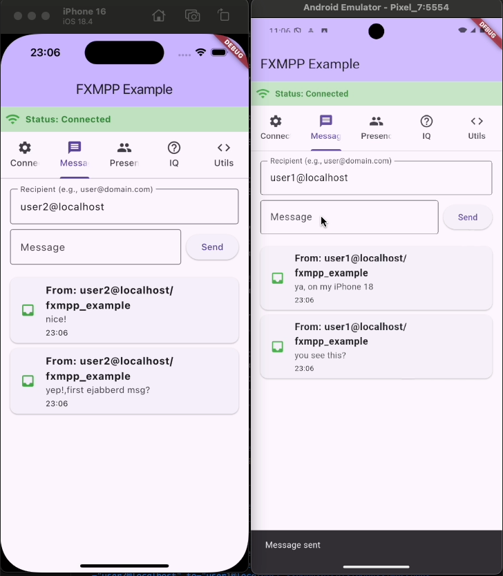

# FXMPP

A Flutter plugin for XMPP (Extensible Messaging and Presence Protocol) communication, supporting both iOS and Android platforms with real-time messaging capabilities.



## Features

- ✅ Cross-platform support (iOS and Android)
- ✅ Real-time messaging
- ✅ Presence management
- ✅ IQ (Info/Query) stanza support
- ✅ Connection state monitoring
- ✅ SSL/TLS encryption support
- ✅ Stream-based architecture
- ✅ Comprehensive example app

## Platform Support

| Platform | Implementation |
|----------|----------------|
| iOS      | XMPPFramework  |
| Android  | Smack Library  |

## Installation

Add this to your package's `pubspec.yaml` file:

```yaml
dependencies:
  fxmpp: ^1.0.0-alpha
```

Then run:

```bash
flutter pub get
```

## Usage

### Basic Setup

```dart
import 'package:fxmpp/fxmpp.dart';

class MyApp extends StatefulWidget {
  @override
  _MyAppState createState() => _MyAppState();
}

class _MyAppState extends State<MyApp> {
  final Fxmpp _fxmpp = Fxmpp();

  @override
  void initState() {
    super.initState();
    _initializeXMPP();
  }

  Future<void> _initializeXMPP() async {
    await _fxmpp.initialize();
    
    // Listen to connection state changes
    _fxmpp.connectionStateStream.listen((state) {
      print('Connection state: ${state.description}');
    });
    
    // Listen to incoming messages
    _fxmpp.messageStream.listen((message) {
      print('Received message: ${message.body}');
    });
    
    // Listen to presence updates
    _fxmpp.presenceStream.listen((presence) {
      print('Presence update: ${presence.from} is ${presence.show.name}');
    });
    
    // Listen to IQ stanzas
    _fxmpp.iqStream.listen((iq) {
      print('Received IQ: ${iq.toXmlString()}');
    });
  }

  @override
  void dispose() {
    _fxmpp.dispose();
    super.dispose();
  }
}
```

### Connecting to XMPP Server

```dart
final config = XmppConnectionConfig(
  host: 'your-xmpp-server.com',
  port: 5222,
  username: 'your-username',
  password: 'your-password',
  domain: 'your-domain.com',
  useSSL: true,
  resource: 'your-app-name',
);

try {
  final success = await _fxmpp.connect(config);
  if (success) {
    print('Connected successfully');
  }
} catch (e) {
  print('Connection failed: $e');
}
```

### Sending Messages

```dart
final message = XmppMessage(
  id: DateTime.now().millisecondsSinceEpoch.toString(),
  from: 'sender@domain.com',
  to: 'recipient@domain.com',
  body: 'Hello, World!',
  timestamp: DateTime.now(),
  type: XmppMessageType.chat,
);

final success = await _fxmpp.sendMessage(message);
if (success) {
  print('Message sent successfully');
}
```

### Sending IQ Stanzas

```dart
import 'package:xml/xml.dart';

// Create a ping IQ
final builder = XmlBuilder();
builder.element('iq', nest: () {
  builder.attribute('type', 'get');
  builder.attribute('to', 'server.example.com');
  builder.attribute('id', 'ping_${DateTime.now().millisecondsSinceEpoch}');
  builder.element('ping', nest: () {
    builder.attribute('xmlns', 'urn:xmpp:ping');
  });
});
final iq = builder.buildDocument();

final success = await _fxmpp.sendIq(iq);
if (success) {
  print('IQ sent successfully');
}
```

### Managing Presence

```dart
final presence = XmppPresence(
  from: 'user@domain.com',
  show: XmppPresenceShow.online,
  status: 'Available',
  timestamp: DateTime.now(),
);

final success = await _fxmpp.sendPresence(presence);
if (success) {
  print('Presence updated');
}
```

### Disconnecting

```dart
await _fxmpp.disconnect();
```

## API Reference

### Classes

#### `Fxmpp`
Main class for XMPP operations.

**Methods:**
- `initialize()` - Initialize the plugin
- `connect(XmppConnectionConfig config)` - Connect to XMPP server
- `disconnect()` - Disconnect from server
- `sendMessage(XmppMessage message)` - Send a message
- `sendPresence(XmppPresence presence)` - Send presence update
- `sendIq(XmlDocument iq)` - Send an IQ stanza
- `getConnectionState()` - Get current connection state
- `dispose()` - Clean up resources

**Streams:**
- `connectionStateStream` - Stream of connection state changes
- `messageStream` - Stream of incoming messages
- `presenceStream` - Stream of presence updates
- `iqStream` - Stream of incoming IQ stanzas

#### `XmppConnectionConfig`
Configuration for XMPP connection.

**Properties:**
- `host` - XMPP server hostname
- `port` - Server port (default: 5222)
- `username` - Username for authentication
- `password` - Password for authentication
- `domain` - XMPP domain
- `useSSL` - Enable SSL/TLS (default: true)
- `allowSelfSignedCertificates` - Allow self-signed certificates (default: false)
- `resource` - Client resource identifier

#### `XmppMessage`
Represents an XMPP message.

**Properties:**
- `id` - Unique message identifier
- `from` - Sender JID
- `to` - Recipient JID
- `body` - Message content
- `timestamp` - Message timestamp
- `type` - Message type (chat, groupchat, etc.)
- `extensions` - Additional message data

#### `XmppPresence`
Represents XMPP presence information.

**Properties:**
- `from` - Sender JID
- `to` - Target JID (optional)
- `type` - Presence type
- `show` - Presence show value
- `status` - Status message
- `priority` - Presence priority
- `timestamp` - Presence timestamp

### Enums

#### `XmppConnectionState`
- `disconnected` - Not connected
- `connecting` - Connection in progress
- `connected` - Connected and authenticated
- `disconnecting` - Disconnection in progress
- `error` - Connection error
- `authenticationFailed` - Authentication failed
- `connectionLost` - Connection lost unexpectedly

#### `XmppMessageType`
- `chat` - One-to-one chat message
- `groupchat` - Group chat message
- `headline` - Headline message
- `normal` - Normal message
- `error` - Error message

#### `XmppPresenceType`
- `available` - Available presence
- `unavailable` - Unavailable presence
- `subscribe` - Subscription request
- `subscribed` - Subscription approved
- `unsubscribe` - Unsubscription request
- `unsubscribed` - Unsubscription approved
- `probe` - Presence probe
- `error` - Presence error

#### `XmppPresenceShow`
- `online` - Online/available
- `away` - Away
- `chat` - Available for chat
- `dnd` - Do not disturb
- `xa` - Extended away

## Example App

The package includes a comprehensive example app that demonstrates all features. To run the example:

```bash
cd example
flutter run
```

The example app includes:
- Connection management UI
- Real-time messaging interface
- Presence management controls
- IQ stanza examples (Ping, Version, Time, Disco Info, Roster)
- Connection state monitoring

## Platform-Specific Setup

### iOS

The iOS implementation uses XMPPFramework. No additional setup is required as the framework is automatically included via CocoaPods.

### Android

The Android implementation uses the Smack library. The required dependencies are automatically included in the plugin.

Required permissions are automatically added to your app's `AndroidManifest.xml`:
- `INTERNET` - For network communication
- `ACCESS_NETWORK_STATE` - For network state monitoring

## Security Considerations

- Always use SSL/TLS in production (`useSSL: true`)
- Avoid using `allowSelfSignedCertificates: true` in production
- Store credentials securely (consider using flutter_secure_storage)
- Validate all incoming messages and presence updates

## Troubleshooting

### Common Issues

1. **Connection fails with SSL errors**
   - Ensure your XMPP server supports SSL/TLS
   - Check if the server certificate is valid
   - For testing only, you can set `allowSelfSignedCertificates: true`

2. **Authentication fails**
   - Verify username and password are correct
   - Ensure the user account exists on the XMPP server
   - Check if the domain is correct

3. **Messages not being received**
   - Ensure you're listening to the `messageStream`
   - Check if the connection is in `connected` state
   - Verify the recipient JID is correct

4. **iOS build issues**
   - Run `cd ios && pod install` in your app directory
   - Clean and rebuild your project

5. **Android build issues**
   - Ensure your `minSdkVersion` is at least 16
   - Clean and rebuild your project

## Contributing

Contributions are welcome! Please feel free to submit a Pull Request.

## License

This project is licensed under the MIT License - see the LICENSE file for details.

## Support

For issues and questions, please use the [GitHub Issues](https://github.com/haithngn/fxmpp/issues) page.

## Changelog

### 1.0.0-alpha
- Added IQ (Info/Query) stanza support
- Enhanced example app with IQ examples
- Fixed XML parsing issues
- Improved cross-platform compatibility
- Added comprehensive IQ documentation

### 0.1.0
- Initial release
- Cross-platform XMPP support
- Real-time messaging
- Presence management
- Connection state monitoring
- SSL/TLS support
- Comprehensive example app
